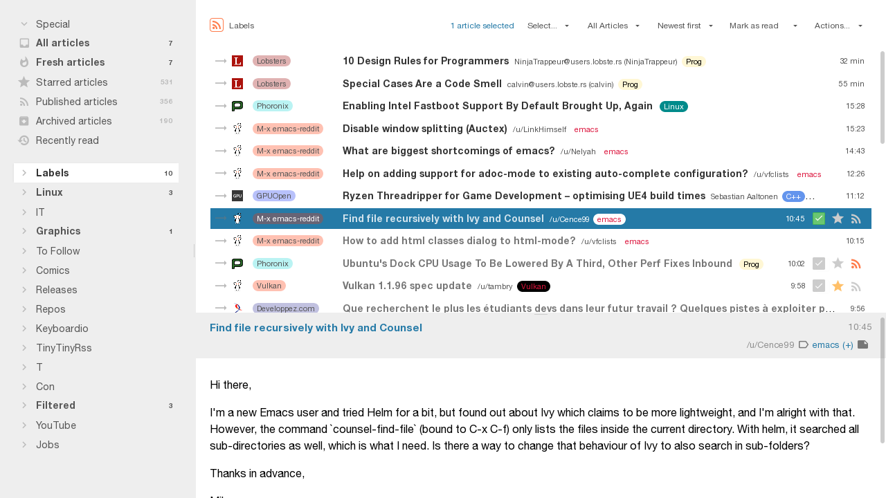
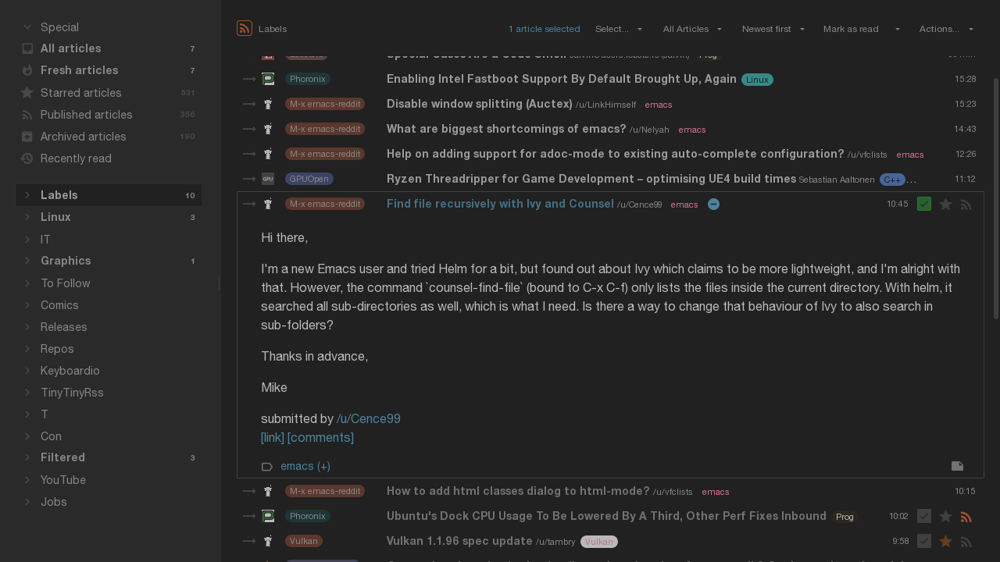

## Tiny Tiny RSS Feedlish Theme

"Close enough" clone of [levito's tt-rss-feedly-theme](https://github.com/levito/tt-rss-feedly-theme) working on
[Tiny Tiny RSS](https://tt-rss.org/) 18.12+.

The current philosophy is to have as little code as possible to stay
maintainable/hackable. So, we start from the default theme and modify/override
it just enough to get close enough to the feedly theme.

Some changes might diverge from the feedly theme.

Not all tt-rss configurations (day/night/wide/combined/...) are currently
tested, Issues/PRs are welcome.

### Install

```
cd /path/to/tt-rss/themes.local/

git clone https://github.com/Gravemind/tt-rss-feedlish-theme

ln -s tt-rss-feedlish-theme/feedlish.css
ln -s tt-rss-feedlish-theme/feedlish.css.map
ln -s tt-rss-feedlish-theme/feedlish-night.css
ln -s tt-rss-feedlish-theme/feedlish-night.css.map
```

### Customize

There is a bunch of Less CSS variables to make customization easier, see [./feedly.less]().

To customize them, or add more CSS rules, you can create a file `./local.less`;
for example:

```css
// tt-rss-feedlish-theme/local.less

@default-bg: #e8e8e8;		// darker background
@default-fg: #606060;		// lighter foreground text
@color-accent: #ec8200;     // orange highlights
//@color-accent: #ffe100;   // feedly-yellow-ish highlights

@feedlish-hide-author-in-headlines: true;   // hide author
@feedlish-hide-score-in-headlines: true;    // hide score

// See ./feedlish.less for more variables.

```

**But if you customize, you must [rebuild the CSS files](#Rebuild)!**

### Rebuild

The default CSS files are rebuild and commit periodically to make default
installation easier.

But, if and any `.less` file is changed (`feedly*.less`, `local.less`, or any
tt-rss default theme's `.less` files), the CSS files need to be rebuild:

- install `lessc` (`pacman -S nodejs-less`, `dnf install nodejs-less nodejs-source-map`, ...)
- run `make` here

### Screenshots




