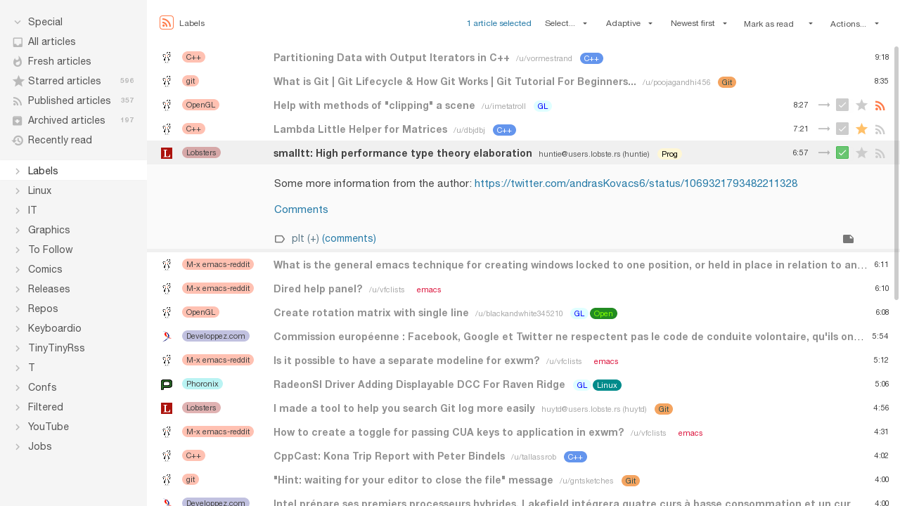
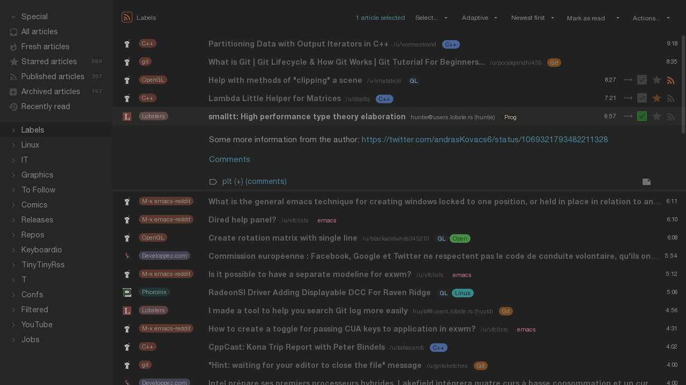

## Tiny Tiny RSS Feedlish Theme

"Close enough" clone of [levito's tt-rss-feedly-theme](https://github.com/levito/tt-rss-feedly-theme) working on
[Tiny Tiny RSS](https://tt-rss.org/) 18.12+.

The current philosophy is to have as little code as possible to stay
maintainable/hackable. So, we start from the default theme and modify/override
it just enough to get close enough to the feedly theme.

Some changes might diverge from the feedly theme.

Not all tt-rss configurations (day/night/wide/combined/...) are currently
tested, Issues/PRs are welcome.

### Installation

```
cd /path/to/tt-rss/themes.local/

git clone https://github.com/Gravemind/tt-rss-feedlish-theme

ln -s tt-rss-feedlish-theme/feedlish.css
ln -s tt-rss-feedlish-theme/feedlish.css.map
ln -s tt-rss-feedlish-theme/feedlish-night.css
ln -s tt-rss-feedlish-theme/feedlish-night.css.map
```

### Rebuild

`.css` and `.css.map` files are generated from the `.less` files, and contains a
copy a tt-rss's default theme.

If tt-rss's default theme changes, the `.css` and `.css.map` needs to be
regenerated:
- install `lessc` (`pacman -S nodejs-less`, `dnf install nodejs-less nodejs-source-map`, ...)
- run `make` here

### Screenshots




